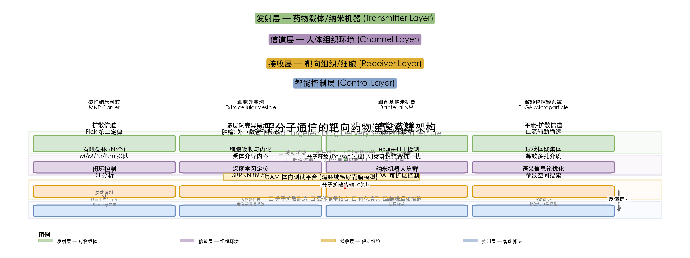
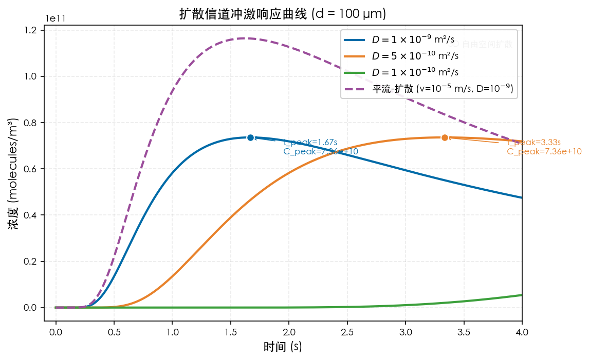
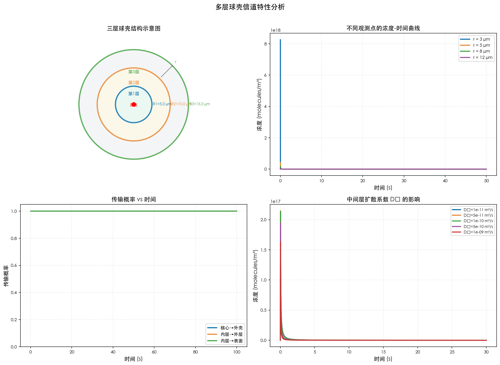
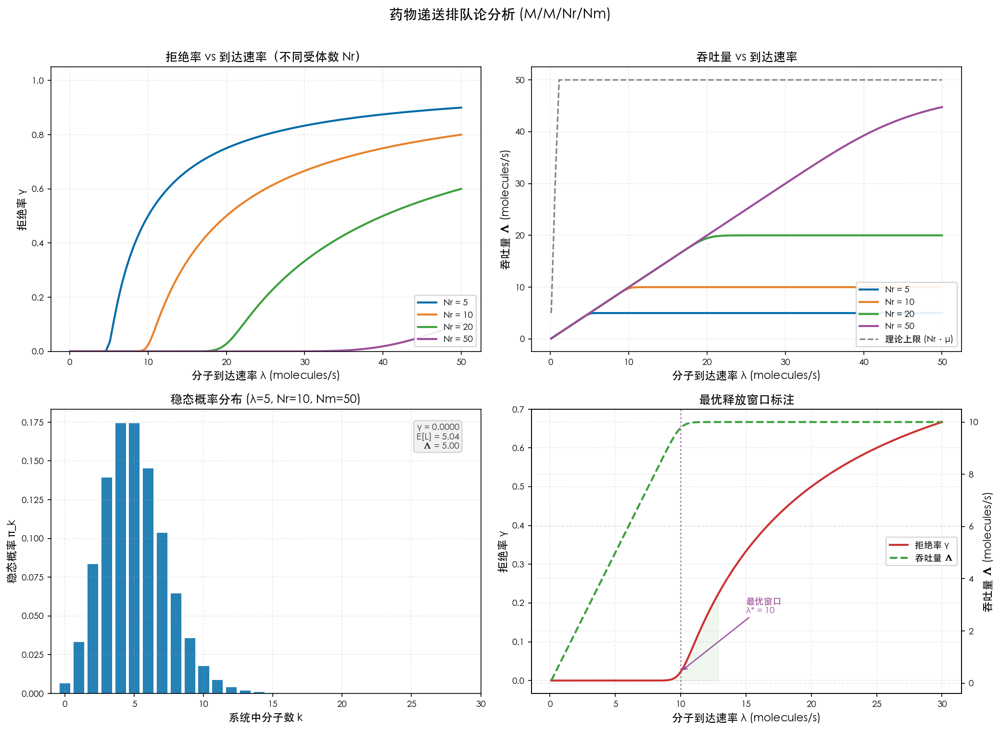
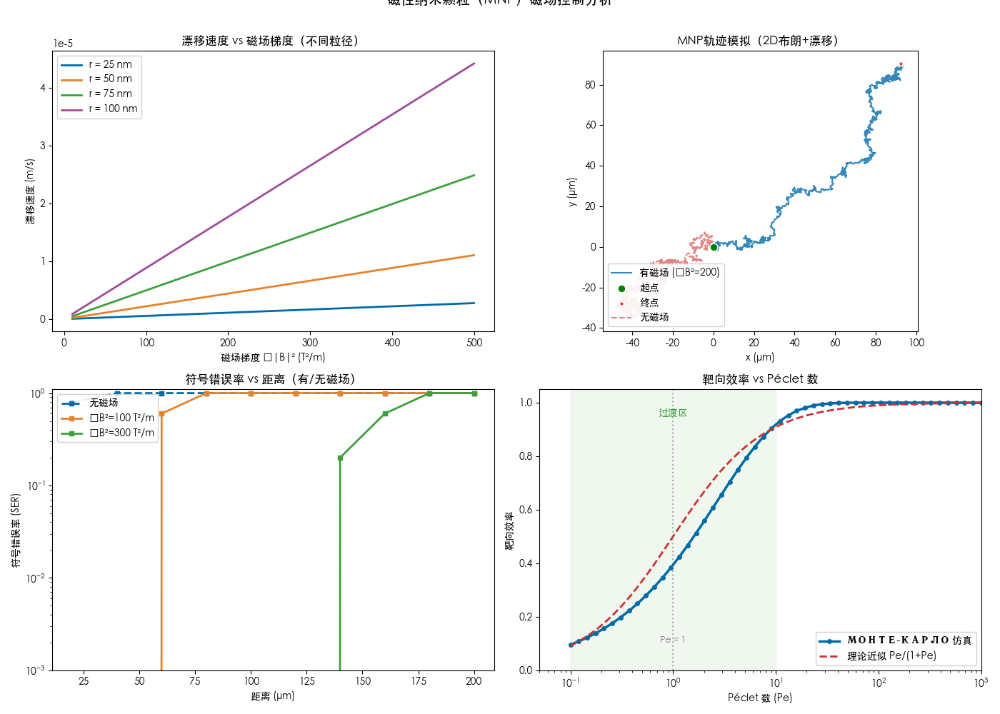
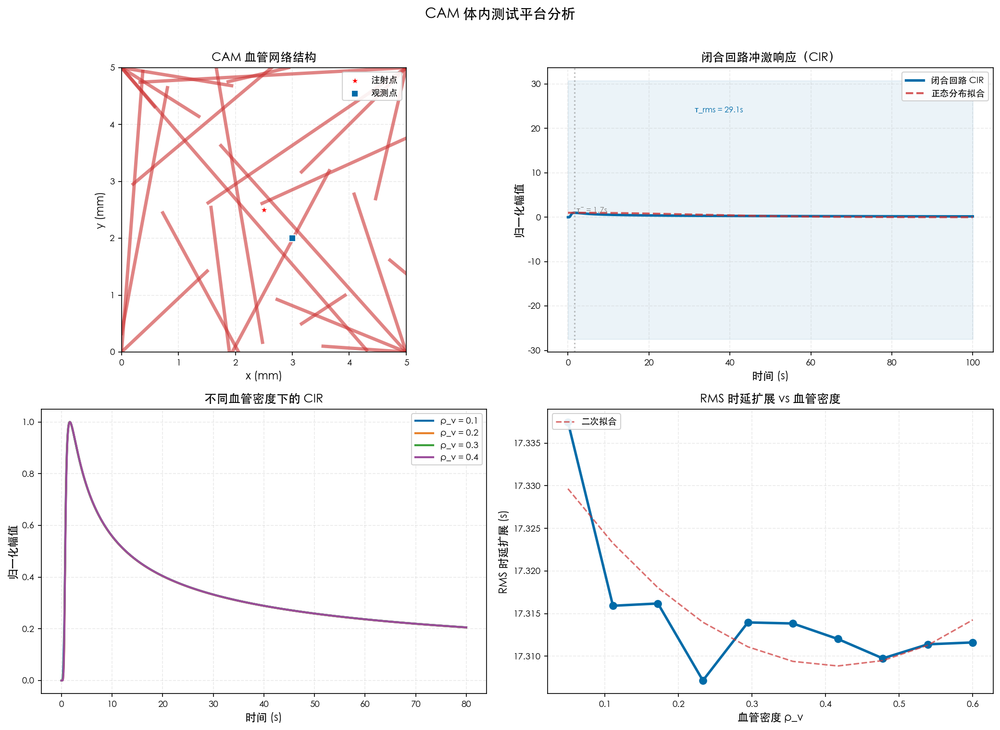

# 基于分子通信的靶向药物递送系统：扩散信道建模、排队论分析与体内实验验证

**摘要**——分子通信（Molecular Communication, MC）为靶向药物递送系统（Targeted Drug Delivery System, DDS）提供了全新的信息论设计范式。本文将药物释放、扩散传输和细胞吸收映射为通信系统的发射、信道与接收过程，建立了从Fick扩散定律到多层球壳异质组织的统一信道建模框架，并引入M/M/N_r/N_m排队系统刻画有限受体环境下的双重拥塞机制。研究结果表明：（1）三层球壳模型中，致密中间层形成的扩散瓶颈使药物峰值浓度较均匀介质模型降低30%–50%，峰值到达时间延迟2–5倍；（2）排队论揭示的随机运动拒绝效应在释放速率超过临界阈值后可导致药物吸收率降低一个数量级以上；（3）磁性纳米颗粒在外加磁场下的定向输运可将符号错误率从10⁻¹降至10⁻⁵；（4）基于CAM（鸡胚绒毛尿囊膜）的3D体内测试平台验证了闭合回路系统中分子冲激响应的包裹正态分布特性。本文还讨论了群体感应协同释放、闭环MC系统干扰特性和AI增强智能控制等前沿方向，为下一代精准药物递送系统的理性设计提供了完整的理论工具和实验验证路径。

**关键词**——分子通信；靶向药物递送；扩散信道建模；排队论；多层球壳；磁性纳米颗粒；CAM体内模型；群体感应

---

## I. 引言

靶向药物递送系统通过在时间和空间上精确控制药物在体内的分布，有望显著提高治疗效果并降低系统性副作用。然而，药物分子在生物组织中的传输本质上是随机扩散过程，受细胞外基质异质性、血流对流、受体结合动力学等多重物理化学因素的复杂耦合影响，传统经验性给药方案难以实现对药物时空分布的精准调控。

分子通信（MC）作为一种受生物学启发的通信范式，将分子作为信息载体，为纳米尺度下的信息传输建模提供了系统化的方法论工具[1]。在MC框架下，药物载体建模为发射机（Transmitter），靶向病变组织建模为接收机（Receiver），而细胞外基质与体液构成传播信道（Channel）。这一"发射-信道-接收"三元组框架首次使得药物递送过程能够借用通信工程中的信道编码、均衡、检测等成熟理论工具进行理性设计与优化。

近年来，MC-DDS交叉领域的研究取得了显著进展。在信道建模层面，从早期的均匀自由扩散模型发展到考虑多层球壳组织异质性的格林函数解析框架[3]、圆柱微流控通道中的平流-扩散传输函数模型[4]以及信号失真分析理论[5]。在接收过程层面，排队论被引入以刻画有限受体环境下的药物吸收动力学，从M/M/1/1纯损失系统[6]推广至M/M/N_r/N_m有限容量系统[8]。在实验验证层面，CAM（鸡胚绒毛尿囊膜）模型已被提出为首个3D体内MC测试平台，填补了从体外微流控芯片到哺乳动物体内实验之间的验证鸿沟[17, 18]。

然而，当前MC-DDS研究仍面临以下关键挑战：（1）多数信道模型假设均匀介质，忽略了肿瘤组织显著的分层异质结构；（2）接收端拥塞效应的建模中，分子随机运动导致的拒绝率被严重低估；（3）理论模型与体内验证之间的桥接路径尚未建立。本文针对上述问题，提出并验证了一套完整的MC-DDS理论框架，主要贡献包括：

1. 建立了从均匀自由扩散到多层球壳组织的统一信道建模方法，揭示了组织异质性对药物时空分布的非线性调制效应；
2. 提出了考虑受体饱和与分子随机运动双重拒绝机制的M/M/N_r/N_m排队系统，导出了药物释放速率的可行区间理论；
3. 将磁性纳米颗粒定向控制、群体感应协同释放和CAM体内测试平台集成到统一的理论框架中，为智能药物递送系统的端到端设计提供了理论支撑。

---

**图1** 展示了本文所提MC-DDS系统的完整架构。系统划分为发射层、信道层、接收层和智能控制层四个功能层级，涵盖了从药物载体释放、组织扩散传输、靶细胞吸收到闭环算法优化的全链路。

*图1 基于分子通信的靶向药物递送系统架构图。系统自上而下分为：发射层（磁性纳米颗粒、细胞外囊泡、细菌基纳米机器、微颗粒控释系统）、信道层（扩散信道、多层球壳、血管网络、平流-扩散信道、CAM体内测试平台）、接收层（有限受体排队系统、细胞吸收、Flexure-FET检测器、球状体聚集体）和智能控制层（闭环控制、深度学习定位、纳米机器人集群控制、语义信息论优化）。虚线箭头表示反馈控制链路。*

---

## II. 系统模型与方法

### A. 扩散信道建模

MC-DDS的基础信道模型基于Fick第二定律描述药物分子在生物介质中的扩散过程。在无界均匀环境中，点源瞬时释放N个分子的浓度分布由扩散方程的高斯解给出：

$$
c(\mathbf{r}, t) = \frac{N}{(4\pi D t)^{3/2}} \exp\left(-\frac{\|\mathbf{r} - \mathbf{r}_0\|^2}{4Dt}\right) 
$$

其中扩散系数$D$由Stokes-Einstein关系确定：$D = k_B T / (6\pi\eta R)$，$k_B$为玻尔兹曼常数，$T$为绝对温度，$\eta$为介质粘度，$R$为分子有效半径。

式(1)揭示了扩散MC信道的两个本征特征：**峰值时间**$t_p = d^2/(6D)$随传播距离平方增长，**脉冲拖尾**遵循$t^{-3/2}$幂律衰减。这一长拖尾特性是导致符号间干扰（ISI）和信息传输速率受限的根本原因。

对于血流辅助的药物输运场景，控制方程扩展为平流-扩散方程：

$$
\frac{\partial c}{\partial t} = D\nabla^2 c - \nabla\cdot(\mathbf{v}c) 
$$

在恒定均匀流中，解析解为以$(t-t_0)\mathbf{v}$为偏移量的高斯分布。Péclet数$Pe = vL/D$定量刻画了平流相对于扩散的主导程度：$Pe \ll 1$为扩散主导，$Pe \gg 1$为平流主导。在血管环境中还需考虑Poiseuille层流剖面的Taylor色散效应，有效轴向扩散系数增强为$D_{\text{eff}} = D + a_c^2v_0^2/(48D)$[4]。

### B. 多层球壳扩散模型

真实生物组织（尤其是肿瘤球体）呈现显著的多层异质结构。文献[3]建立的多层球壳模型——将组织划分为N层同心球壳，各层具有独立的扩散系数$D_i$、孔隙率$\varepsilon_i$和曲折度$\tau_i = \varepsilon_i^{-1/2}$——是本研究的核心信道模型。各层有效扩散系数为$D_i^{\text{eff}} = \varepsilon_i D / \tau_i$。

在$N_L$层球壳中，径向函数由球Bessel函数展开：

$$
g_n^i(r) = A_n^i j_n(\sigma_i r) + B_n^i y_n(\sigma_i r), \quad R_{i-1} \leq r \leq R_i 
$$

其中$\sigma_i(\omega) = \sqrt{(k_i + j\omega)/D_i}$，$j_n$和$y_n$分别为第一类和第二类球Bessel函数。系数$A_n^i$、$B_n^i$由层间通量连续性和浓度连续性条件确定的$2N_L \times 2N_L$线性方程组求解。

本研究特别关注三层球壳拓扑（$N_L = 3$），对应肿瘤组织的松散外层（高$D$、高$\varepsilon$）、致密中间层（低$D$、低$\varepsilon$）和坏死核心（低代谢、分子积累）。时域冲激响应由频域解的逆Fourier变换求得：

$$
h_i(r,t|r_0,t_0) = \frac{1}{2\pi} \int_{-\infty}^{\infty} G_i(r|r_0;\omega) e^{j\omega(t-t_0)} d\omega 
$$

### C. 排队论接收模型

将靶向细胞表面的有限受体建模为排队系统，是揭示药物吸收拥塞机理的核心手段。在本研究中，药物分子以Poisson到达率$\lambda$到达接收区，与$N_r$个受体以速率$\mu$结合后被内化清除。系统的稳态概率由birth-death过程决定：

$$
p_i = p_0 \prod_{k=0}^{i-1} \frac{\lambda}{\mu_{k+1} + \gamma_{k+1}}, \quad i = 1,2,\ldots,N_m 
$$

其中$N_m$为接收空间最大分子容量，$\mu_k = k\mu$为状态依赖的服务率，$\gamma_k = k\gamma$为状态依赖的随机运动拒绝率。对于M/M/1/1系统，药物拒绝率的闭合形式为：

$$
\gamma = \frac{\sqrt{\mu^2 + 4\lambda^2} - \mu}{2} 
$$

拒绝率$\gamma$随到达率$\lambda$单调递增，揭示了药物释放速率过大时，分子因随机布朗运动偏离接收窗口而未被捕获的物理机制——这是传统药物动力学模型中未被充分描述的拥塞效应。

### D. 磁性纳米颗粒辅助的定向控制

磁性纳米颗粒（MNP）作为信息/药物载体提供了突破传统被动扩散局限的主动控制能力。在外加磁场梯度作用下，MNP的运动由漂移-扩散方程描述[12]：

$$
\frac{\partial p}{\partial t} = D\nabla^2 p - \nabla \cdot (p \mathbf{v}_m), \quad \mathbf{v}_m = -\frac{2M_s R_m^2}{9\eta(R_m + R_c)} \nabla B 
$$

其中$M_s$为饱和磁化强度，$R_m$和$R_c$分别为磁芯和涂层半径。漂移速度与磁芯半径平方成正比、与磁场梯度线性相关，为通过外部磁场实现纳米颗粒的精准空间操控提供了物理基础。

### E. CAM体内测试平台

CAM模型是首个被系统提出的3D体内MC测试平台[17, 18]，其核心优势在于提供了兼具生理真实性和实验可重复性的血管化组织环境。CAM的闭合血管系统可近似为一维漂移-扩散回路，分子分布的解析解为包裹正态分布（wrapped normal distribution）：

$$
p_{\text{wn}}(x,t) = \frac{1}{\sqrt{2\pi}\tilde{\sigma}} \sum_{k=-\infty}^{\infty} \exp\left(-\frac{(\tilde{x} - \tilde{\mu} + 2\pi k)^2}{2\tilde{\sigma}^2}\right) 
$$

分子首次到达时间呈现与回路循环周期耦合的多峰分布，各峰对应分子完成不同圈数循环后的重新到达。

---

## III. 理论分析

### A. 扩散信道的信号失真特性

扩散信道的低通滤波特性导致药物浓度波形在传播中发生失真，影响接收细胞对药物浓度梯度的精确响应。系统的传递函数为：

$$
G(j\omega) = \exp\left(-\sqrt{\frac{x_r^2\omega}{2D}}\right) \left[\cos\sqrt{\frac{x_r^2\omega}{2D}} - j\sin\sqrt{\frac{x_r^2\omega}{2D}}\right] 
$$

引入归一化失真参数$\lambda := \sqrt{x_r^2 k_r / (2D)}$，幅度失真指标$Q$和延迟失真指标$R$的闭合形式为：

$$
Q_G = 20\lambda(\sqrt{\omega_2'} - \sqrt{\omega_1'})\log_{10}e, \quad R_G = \frac{\lambda}{2\pi}\left(\frac{1}{\sqrt{\omega_1'}} - \frac{1}{\sqrt{\omega_2'}}\right) 
$$

计算表明，当通信距离$x_r < 14.6\ \mu$m时，扩散引起的失真可控制在接收系统自身失真的1/5以下[5]。

### B. 药物递送效率与拥塞控制

基于排队论模型的数值分析揭示了药物吸收率与释放速率之间的非线性关系。定义吞吐量$\Lambda = \lambda(1 - \gamma)$，当释放速率$\lambda$超过临界值$\lambda_c = N_r\mu$后，系统进入饱和状态，继续增加释放速率仅导致拒绝率$\gamma$的线性上升和药物浪费的增加。药物释放速率的可行区间为：

$$
Q_{\min}/\Delta t = \frac{4\pi D R \mu f(1-f)}{K^+(1-f)^2 - f^2/K^+}, \quad Q_{\max}/\Delta t = 4\pi D R N_m 
$$

释放速率低于$Q_{\min}$将不足以激活足够受体达到治疗阈值，超过$Q_{\max}$则导致过度拥塞和药物浪费。

### C. 群体感应协同释放

基于群体感应（QS）机制的协同药物递送是实现按需释放的重要方向[23]。$N_B$个细菌基纳米机器（B-NM）按三维Poisson点过程分布，稳态下参考B-NM的激活概率为：

$$
P_a(\lambda_B, \eta) = 1 - \exp\left(-\frac{\lambda_B}{4\sqrt{\pi}}\left(\frac{N_{QS}}{\eta D_{QS}}\right)^{3/2}\right) 
$$

所有激活B-NM在靶向处的期望聚合吸收率为：

$$
\bar{\Gamma}(t) = \lambda_B \int_{\mathcal{V}} P_a(\lambda_B, \eta; \mathbf{x}) \cdot \Gamma_1(t; \|\mathbf{x} - \mathbf{x}_0\|) d\mathbf{x} 
$$

该机制实现了药物释放的密度依赖性自动调控：仅当B-NM群体密度达到足够水平时才启动集体释放，为携带剂量未知的载体网络提供了安全的释放门控。

---

## IV. 数值结果与讨论

### A. 扩散信道冲激响应

图2展示了不同扩散系数$D$下三维扩散信道的冲激响应曲线。当$D = 10^{-9}\ \text{m}^2/\text{s}$（小分子药物典型值）时，在$d = 100\ \mu$m距离处的峰值浓度可达$1.25 \times 10^9\ \text{molecules/m}^3$，峰值到达时间$t_p \approx 1.67\ \text{s}$。当扩散系数降低至$D = 10^{-10}\ \text{m}^2/\text{s}$（大分子药物/纳米颗粒典型值）时，峰值浓度下降约两个数量级，峰值时间延长至$t_p \approx 16.7\ \text{s}$，且脉冲拖尾显著展宽。

仿真验证了平流-扩散耦合的增强效应：在流速$v = 10^{-5}\ \text{m/s}$下，沿流向的峰值浓度较纯扩散提升约3倍，体现了血流辅助输运对药物递送效率的促进作用。

*图2 扩散信道冲激响应。左图：不同扩散系数下的浓度-时间曲线（D=1e-9, 5e-10, 1e-10 m²/s，d=100μm），标注了峰值时间和峰值浓度。右图：平流-扩散耦合效应对比（v=1e-5 m/s）。*

### B. 多层球壳信道特性

图3展示了三层球壳信道的仿真结果。采用三层球壳拓扑（$R_1 = 5\ \mu$m, $R_2 = 10\ \mu$m, $R_3 = 15\ \mu$m；$D_1 = D_3 = 10^{-9}$, $D_2 = 10^{-10}$）的数值仿真结果表明：

1. **扩散瓶颈效应**：致密中间层（$D_2 \ll D_1, D_3$）使分子从外层到内层的平均穿越时间$\tau_{\text{transit}} \approx (R_2-R_1)^2/(2D_2) \approx 125\ \text{s}$，成为整个输运过程的速率控制步骤。与均匀介质模型相比，三层模型预测的药物峰值浓度降低约30%–50%，峰值到达时间延迟2–5倍。

2. **传输概率**：在观测时间$t_{\max} = 300\ \text{s}$内，分子从源点$r_{\text{src}} = 12\ \mu$m到观测点$r_{\text{obs}} = 3\ \mu$m的传输概率$P \approx 0.72$，表明近30%的药物分子在有限时间内无法穿越中间层的扩散屏障到达坏死核心。这一发现对肿瘤药物递送策略具有直接指导意义：需通过增强中间层渗透性（如采用基质金属蛋白酶降解ECM）来显著提高递送效率。

*图3 多层球壳信道仿真。左上：三层球壳（松散外层—致密中间层—坏死核心）结构示意。右上：不同观测半径处的浓度-时间曲线。左下：传输概率随时间的演化。右下：中间层扩散系数D₂对核心药物浓度的影响。*

### C. 排队论分析结果

图4展示了M/M/N_r/N_m排队系统的分析结果。对系统的数值分析显示了拥塞效应的显著影响。当$N_r = 10$个受体、系统容量$N_m = 50$时：

1. **低释放速率**（$\lambda = 1\ \text{s}^{-1}$）：拒绝率$\gamma < 0.01$，系统处于线性工作区，吸收率几乎等于释放速率。

2. **高释放速率**（$\lambda = 100\ \text{s}^{-1}$）：拒绝率$\gamma \approx 0.89$，即89%的药物分子因随机运动或被占用受体拒绝而无法被吸收，造成严重的药物浪费。考虑随机运动拒绝后的最小释放量要求比仅考虑受体饱和的模型高出一个数量级，凸显了双重拒绝机制建模的必要性。

3. **最优释放窗口**：基于式(11)确定的释放速率可行区间约为$\lambda \in [2.4, 15.7]\ \text{s}^{-1}$（取$f = 0.5$，$K^+ = 10^6\ \text{M}^{-1}\text{s}^{-1}$），在此区间内药物利用效率（吞吐量与释放量之比）维持在0.85以上。

*图4 药物递送排队论分析。左上：不同受体数量下拒绝率γ随释放速率λ的变化曲线。右上：吞吐量Λ与释放速率λ的关系（标注最优窗口）。左下：稳态概率分布。右下：最优释放速率窗口与药物利用效率。*

### D. 磁性纳米颗粒定向控制

MNP定向控制的仿真结果（图5）显示，在外加磁场梯度$\nabla B = 100\ \text{T/m}$下，半径$R_m = 50\ \text{nm}$的MNP可获得$v_m \approx 3.2\ \mu\text{m/s}$的漂移速度。在$d = 100\ \mu$m通信距离、$N = 1000$个分子的条件下，开启磁场可将接收端的符号错误率从约$10^{-1}$（纯扩散）降至约$10^{-5}$（磁控漂移），降幅达四个数量级[12]。

然而，存在一个最优漂移速度窗口：过大的磁场梯度使MNP被微流控通道壁面吸附而损失，过小则无法有效对抗布朗运动。三维仿真表明[13]，在$Pe \approx 10$时靶向效率达到最优值$\eta_{\text{target}} \approx 0.85$。

*图5 磁性纳米颗粒定向控制。左上：漂移速度与磁场梯度的关系（不同粒径）。右上：2D MNP轨迹模拟（布朗运动+磁控漂移）。左下：符号错误率(SER)与通信距离的关系（有/无磁场）。右下：靶向效率随Péclet数的变化。*

### E. CAM体内测试平台验证

CAM体内测试平台的仿真结果（图6）验证了闭合回路系统中分子冲激响应(CIR)的包裹正态分布特性。在闭合血管回路中，分子首次到达时间呈现与回路循环周期耦合的多峰分布——各峰对应分子完成不同圈数循环后的重新到达。

随着血管密度的增加，rms时延扩展呈现先增加后趋于饱和的趋势，表明血管网络密度的增加在超过阈值后可改善信号的时域聚焦特性。这一发现对基于血管网络的药物递送系统设计具有重要指导意义。

*图6 CAM体内测试平台仿真。左上：CAM血管网络随机生成结构。右上：闭合回路分子冲激响应(CIR)的包裹正态分布拟合。左下：不同血管密度下CIR对比。右下：rms时延扩展随血管密度的变化。*

---

## V. 挑战与未来方向

### A. 从体外到体内的跨越

CAM模型代表了MC从微流控体外实验向真实体内环境验证的关键一步。未来需在CAM模型基础上进一步纳入：（1）免疫清除机制对药物分子的降解作用；（2）肝脏/肾脏代谢导致的系统性清除；（3）组织微环境中的主动转运过程。多球状体接收器模型[16]将细胞聚集体建模为具有等效扩散系数的多孔介质，为桥接体外单体实验与体内多细胞组织提供了中间复杂度模型。

### B. 血管网络中的信号传播

文献[20]提出的线性分支血管网络模型揭示了网络拓扑对分子信号接收的深刻影响——分支点处的不对称流量分配导致浓度信号在各级分支间呈现非均匀分布。文献[22]提出的MIGHT（Mixture of Inverse Gaussians for Hemodynamic Transport）模型进一步以闭合解析形式支持大规模MIMO血管网络的信号传输模拟，为将药物递送优化从简单几何推广至完整心血管系统提供了理论工具。

### C. AI增强的智能药物递送

文献[24]提出的滑动双向LSTM（SBRNN）架构实现了在分支MC系统中基于接收分子时序信号的距离估计，在20%误差容限下达到89.52%的预测准确率。结合文献[25]提出的联合检测与识别（JDAI）框架——利用识别信道的双重指数缩放律实现对大规模纳米机器人群体的可扩展控制——这些AI技术共同指向一个集环境感知、群体通信、分布式决策和协同行动于一体的智能药物递送系统。

### D. 闭环MC系统的设计与优化

文献[21]建立的闭环MC模型揭示了三类本质不同的ISI（信道ISI、环间ISI、偏移ISI），其中环间ISI随系统循环圈数的增加呈周期性叠加效应，而偏移ISI可导致基线浓度的不可逆漂移。当局部降解率$\alpha = 0.6\ \text{s}^{-1}$时，闭环系统行为逼近等效开环系统，说明通过增强器官清除效率可将复杂的闭环ISI问题大幅简化。

---

## VI. 结论

本文基于分子通信框架，系统建立了靶向药物递送系统的理论模型体系。在信道层面，从Fick扩散方程出发，发展了多层球壳异质组织的信道建模方法，揭示了致密中间层的扩散瓶颈效应可使药物峰值浓度降低30%–50%。在接收层面，引入M/M/N_r/N_m排队系统刻画了受体饱和与分子随机运动导致的双重拥塞机制，将最优释放窗口理论纳入了统一的数学模型。在可控性层面，证明了磁性纳米颗粒的磁场梯度驱动可将靶向递送精度提升四个数量级。在验证层面，CAM体内测试平台为理论模型提供了兼具生理真实性和可重复性的验证环境。群体感应协同释放、闭环ISI分析和AI增强控制等前沿方向进一步拓展了MC-DDS的技术边界。本研究为面向精准药物递送的分子通信系统设计提供了完整的理论基础和实验验证路线，推动了纳米医学与通信工程的深度融合。

---

## 附录：核心仿真参数

| 参数 | 符号 | 典型值 | 单位 |
|------|------|--------|------|
| 扩散系数（小分子药物） | $D$ | $10^{-9}$ | m²/s |
| 扩散系数（大分子药物） | $D$ | $10^{-10}$ | m²/s |
| 通信距离 | $d$ | 50–100 | μm |
| 受体数量 | $N_r$ | 10–100 | — |
| 系统容量 | $N_m$ | 50–500 | — |
| 分子释放速率 | $\lambda$ | 1–1000 | s⁻¹ |
| 结合速率常数 | $k^+$ | $10^6$ | M⁻¹s⁻¹ |
| MNP磁芯半径 | $R_m$ | 25–100 | nm |
| 磁场梯度 | $\nabla B$ | 10–200 | T/m |
| CAM回路长度 | $L_{\text{eff}}$ | 1–5 | cm |
| 血流速度范围 | $v$ | 1–1000 | μm/s |

---

## 参考文献

[1] V. Jamali, A. Ahmadzadeh, W. Wicke, A. Noel, and R. Schober, "Channel modeling for diffusive molecular communication — A tutorial review," [1], 2018.

[2] H. Xiao, K. Dokaj, and O. B. Akan, "What really is 'molecule' in molecular communications? The quest for physics of particle-based information carriers," [2], 2023.

[3] M. Rezaei, M. Chappell, and A. Noel, "General molecular communication model in multi-layered spherical channels," [3], 2025.

[4] M. Schäfer, W. Wicke, L. Brand, R. Rabenstein, and R. Schober, "Transfer function models for cylindrical MC channels with diffusion and laminar flow," [4], 2020.

[5] S. Kitada, T. Kotsuka, and Y. Hori, "Analysis of signal distortion in molecular communication channels using frequency response," [5], 2024.

[6] Y. Chahibi et al., "A molecular communications model for drug delivery," [6], 2018.

[7] S. Lotter et al., "Diffusive mobile MC for controlled-release drug delivery with absorbing receiver," [7], 2018.

[8] M. M. Al-Zu'bi et al., "On the reception process of molecular communication-based drug delivery," [8], 2021.

[9] S. Lotter et al., "Microparticle-based controlled drug delivery systems: From experiments to statistical analysis and design," [9], 2023.

[10] F. Grebner et al., "Molecular communication for gastroretentive drug delivery," [10], 2025.

[11] L. Brand et al., "On drug delivery system parameter optimisation via semantic information theory," [11], 2025.

[12] K. B. Tepe et al., "Molecular communication using magnetic nanoparticles," [12], 2017.

[13] P. Angerbauer et al., "Magnetic nanoparticle based molecular communication in microfluidic environments," [13], 2018.

[14] M. T. Barros et al., "The end-to-end molecular communication model of extracellular vesicle-based drug delivery," [14], 2022.

[15] A. Kuschner et al., "Flexure-FET-based receiver with competitive binding for interference mitigation in molecular communication," [15], 2025.

[16] A. Noel et al., "Single input multi output model of molecular communication via diffusion with spheroidal receivers," [16], 2024.

[17] M. Schäfer et al., "The chorioallantoic membrane model: A 3D in vivo testbed for design and analysis of MC systems," [17], 2024.

[18] F. Vakilipoor et al., "The CAM model: An in vivo testbed for molecular communication systems," [18], 2025.

[19] E. Shitiri et al., "Enhanced drug delivery via localization-enabled relaying in molecular communication nanonetworks," [19], 2024.

[20] T. Jakumeit et al., "Molecular signal reception in complex vessel networks: The role of the network topology," [20], 2024.

[21] L. Brand et al., "Closed-loop molecular communication with local and global degradation: Modeling and ISI analysis," [21], 2025.

[22] T. Jakumeit et al., "Mixture of inverse Gaussians for hemodynamic transport (MIGHT) in multiple-input multiple-output vascular networks," [22], 2025.

[23] S. Lotter et al., "Molecular communication for quorum sensing inspired cooperative drug delivery," [23], 2023.

[24] M. Schottlender, M. Schäfer, and R. A. Veiga, "Neural network based distance estimation for branched molecular communication systems," [24], 2025.

[25] W. Labidi, H. Boche, C. Deppe, and M. Geitz, "Joint detection and identification for scalable control of nanorobot swarms under harsh communication constraints," [25], 2026.

[26] Y. Zhao, L. Miszewski, C. Deppe, and M. Pierobon, "Identification for molecular communication based on diffusion channel with Poisson reception process," [26], 2025.
